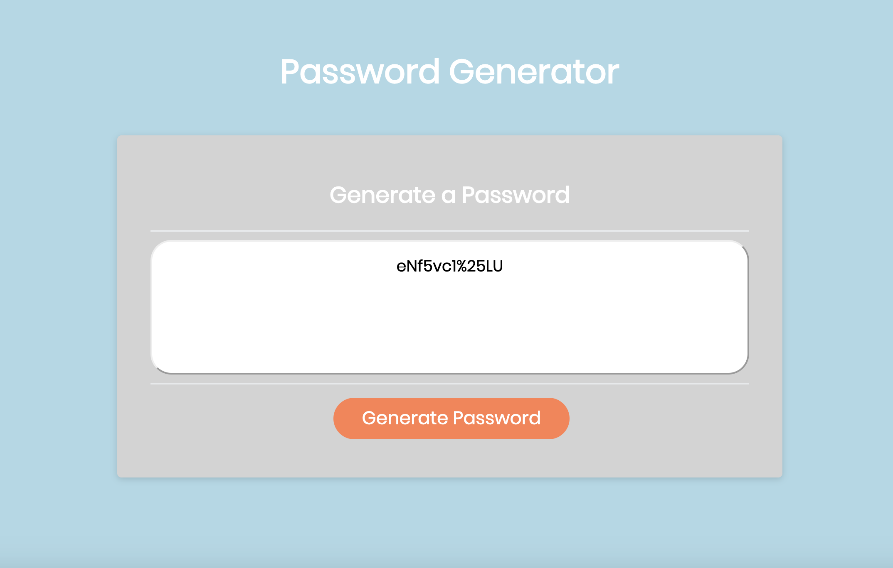

# PasswordGenerator

## Description
This app generates a random password. Users can choose which criteria to include in their password including length, upper or lowercase letters and symbols. 

## User Story
GIVEN I need a new, secure password (criteria)

1. WHEN I click the button to generate a password
   THEN I am presented with a series of prompts for password criteria.
        The first prompt will not begin until the user has clicked on the "generate password" button. This event uses an "event listener" to begin the function when the user clicks on the button.

2. WHEN prompted for password criteria
   THEN I select which criteria to include in the password.
        Once the user has clicked on the "generate password" button, a series of prompts and confirm boxes will alert the user to choose which the length and characters they would like to include in their password.

3. WHEN prompted for the length of the password
   THEN I choose a length of at least 8 characters and no more than 128. characters
        The user is prompted to enter a number for the length of the password. If they enter a number less than 8 or more than 128, the prompt will repeat until they have entered a number between 8 and 128 using a "do while" loop. The number the user chooses is stored in a variable for later.

4. WHEN prompted for character types to include in the password
   THEN I choose lowercase, uppercase, numeric, and/or special characters.
        Four different confirm boxes will appear, asking if the user would like to include uppercase letters, lowercase letters, numbers and/or special characters. By clicking "okay", the user is choosing to include that type of character in their password and by clicking "cancel", the user is choosing not to include that type of character in their password. The users answers are stored in four individual variables for each of the four character types.

5. WHEN I answer each prompt
   THEN my input should be validated and at least one character type should be selected 
        At least one type of character must be chosen in order to generate a password. If the user chooses "cancel" to all four of the confirm boxes, the confirm boxes will continue to prompt until at least one "okay" is chosen using another "do while" loop.

6. WHEN all prompts are answered
   THEN a password is generated that matches the selected criteria.
        Once all of the prompts have been answered and match the criteria to continue, the function will generate a random password. There are four seperate arrays that contain all of the characters for each individual character type. The function will use "if" statements to determine which arrays to concatenate into one larger array that will be used to generate the characters of the user's password. For every character type that the users chooses "okay", the array for that character type will be added to the large array. If the user chooses "cancel" for a character type, the array for that character type will not be added to the large array. Once all of the prompts have been answered, and the correct arrays have been concatonated, the function will use a "for" loop to randomly generate a string of characters from the large array that is the length that the user has chosen.

7. WHEN the password is generated
   THEN the password is either displayed in an alert or written to the page.
        The password will be displayed inside the inner box on the page. The box will contain text reading "your secure password" until the function has been called.
